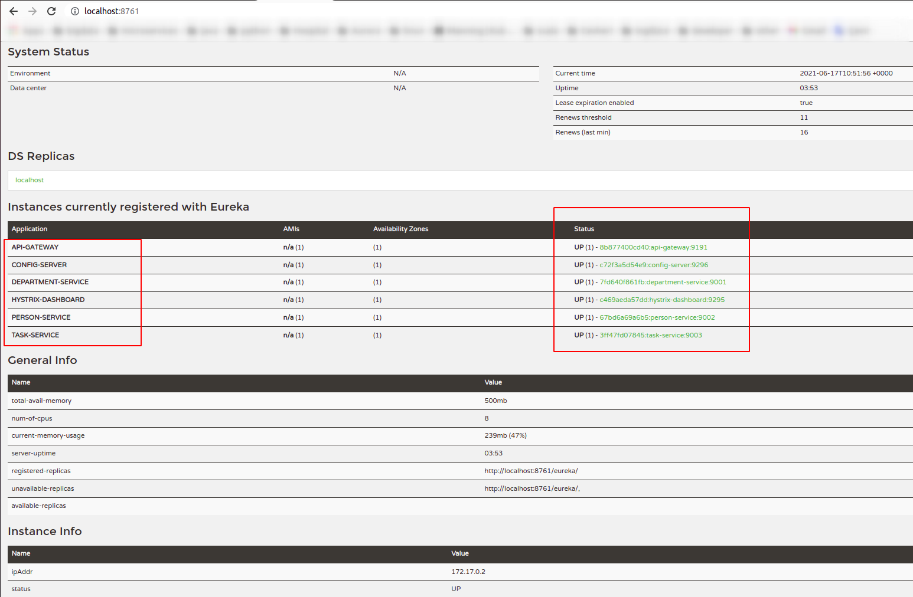

# Java Spring-Boot Microservices Example

Light-weight sample for Microservices learning

---
### [Services Registry](service-registry)
- Spring Boot version: 2.5.0
- Dependencies:
  - spring-cloud-starter-netflix-eureka-server
---
### [API Gateway](api-gateway)
Spring Boot version: 2.3.11.RELEASE
- Dependencies:
  - spring-cloud-starter-gateway  
  - spring-cloud-starter-netflix-hystrix
  - spring-cloud-starter-netflix-eureka-client
  - spring-cloud-starter-config
  - 
---
### [Config Server](config-server)
- Spring Boot version: 2.5.0
- GitHub repository -> application.yml 
- Dependencies:
  - spring-cloud-config-server
  - spring-cloud-starter-netflix-eureka-client
- Zookeeper (not yet)
---
### [Hystrix Dashboard](hystrix-dashboard)
- Spring Boot version: 2.3.11.RELEASE
- Dependencies:
  - spring-cloud-starter-config
  - spring-cloud-starter-netflix-hystrix-dashboard
  - spring-cloud-starter-netflix-eureka-client
---
### Other Microservices
- Spring Boot version: 2.5.0
- [Person](person-service), [Department](department-service), [Task Management](task-service) Services
- Dependencies:
  - spring-cloud-starter-config
  - spring-cloud-starter-netflix-eureka-client
  - spring-cloud-starter-bootstrap
  - com.h2database.h2
  - org.projectlombok.lombok
  - spring-boot-starter-data-jpa
  - spring-boot-starter-web 
---

### [Docker Compose](docker-compose)
Launch all service
```shell
$ docker-compose -f docker-compose/app.yml up -d
```

### Zipkin
Docker
The Docker Zipkin project is able to build docker images, provide scripts, and a docker-compose.yml for launching pre-built images. The quickest start is to run the latest image directly:

docker run -d -p 9411:9411 openzipkin/zipkin
 
---

Project Links: 
- Health : http://person-service:9191/actuator/health
- Eureka : http://service-registry:8761/
- Department GetMethod: http://department-service:9191/departments/1
- Hystrix: http://hystrix-dashboard:9295/hystrix
- http://hystrix-dashboard:9295/hystrix/monitor?stream=http%3A%2F%2Flocalhost%3A9191%2Factuator%2Fhystrix.stream

## Maven and Docker Build -> jib
```shell

$ cd service-registry && ./mvnw -Pprod clean verify jib:dockerBuild && cd ..
$ cd config-server && ./mvnw -Pprod clean verify jib:dockerBuild && cd ..
$ cd api-gateway && ./mvnw -Pprod clean verify jib:dockerBuild && cd ..
$ cd hystrix-dashboard && ./mvnw -Pprod clean verify jib:dockerBuild && cd ..
$ cd department-service && ./mvnw -Pprod clean verify jib:dockerBuild && cd ..
$ cd person-service && ./mvnw -Pprod clean verify jib:dockerBuild && cd ..
$ cd task-service && ./mvnw -Pprod clean verify jib:dockerBuild && cd ..
```

## Run docker-compose
```shell
$ docker-compose -f docker-compose/app.yml up -d
```

## Stop docker-compose
```shell
$ docker-compose -f docker-compose/app.yml down
```

### Screenshots



### References:

- https://spring.io/microservices
- https://microservices.io/patterns/microservices.html
- https://www.infoq.com/articles/spring-boot-tutorial/
- https://developer.okta.com/blog/2019/05/22/java-microservices-spring-boot-spring-cloud
- https://www.manning.com/books/spring-microservices-in-action-second-edition
- https://www.manning.com/books/microservices-in-action
- https://spring.io/blog/2015/07/14/microservices-with-spring
- https://sofienebk.medium.com/building-microservices-with-spring-boot-753be739ca7d
- https://blog.scottlogic.com/2019/10/31/building-microservices-with-spring-boot.html
- https://www.javatpoint.com/microservices
- https://www.amazon.com/Building-Microservices-Designing-Fine-Grained-Systems/dp/1491950358
- https://www.amazon.com/Spring-Boot-Action-Craig-Walls/dp/1617292540
- https://www.amazon.com/Spring-Microservices-Action-John-Carnell/dp/1617293989
- https://www.oreilly.com/library/view/mastering-spring-boot/9781787127562/
