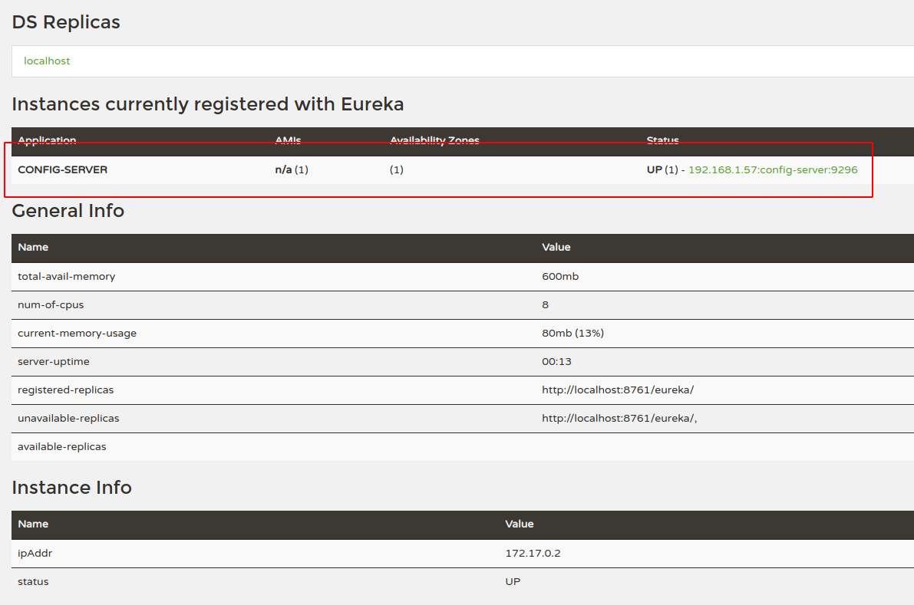

# Java Microservice - Config Server


## Dependencies
* Linux, VirtualBox or Docker Desktop
* Java 11
* Maven
* Git Config Server Repository  
* Spring Boot : 2.5.0  
* Spring Boot Starter
* Spring Cloud Config Server  
* Netflix Eureka Client
* Google Container Tools

## Configuration 
src/main/docker/app.yml
```yaml
version: '3.8'
services:
  config-server:
    image: cevheri/config-server
    environment:
      - _JAVA_OPTIONS=-Xmx512m -Xms256m
    ports:
      - 9296:9296
```

We will use github public repository for our configuration:
https://github.com/cevheri/microservices-config-server


---
## Development
```shell
$ ./mvnw package
$ java -jar target/*.jar
```
Visit : http://localhost:8761/eureka/apps/config-server

---
## Production With Docker
We will create Docker Image using Google Container Tools and run this Docker Image with Docker Compose.

### Build docker image:
```shell
$ ./mvnw -Pprod clean verify jib:dockerBuild

...
[INFO] Executing tasks:
[INFO] [==============================] 100.0% complete
[INFO] 
[INFO] ------------------------------------------------------------------------
[INFO] BUILD SUCCESS
[INFO] ------------------------------------------------------------------------
[INFO] Total time:  17.728 s
[INFO] Finished at: 21:45:11+03:00
[INFO] ------------------------------------------------------------------------
```

---

### Run:
```shell
$ docker-compose -f src/main/docker/app.yml up -d

Creating config-server ... done
```
---
Visit : http://localhost:8761/eureka/apps/config-server
```xml
<application>
    <name>CONFIG-SERVER</name>
    <instance>
        <instanceId>192.168.1.57:config-server:9296</instanceId>
        <hostName>service-registry</hostName>
        <app>CONFIG-SERVER</app>
        <ipAddr>192.168.1.57</ipAddr>
        <status>UP</status>
        <overriddenstatus>UNKNOWN</overriddenstatus>
        <port enabled="true">9296</port>
        <securePort enabled="false">443</securePort>
        <countryId>1</countryId>
        <dataCenterInfo class="com.netflix.appinfo.InstanceInfo$DefaultDataCenterInfo">
            <name>MyOwn</name>
        </dataCenterInfo>
        <leaseInfo>
            <renewalIntervalInSecs>30</renewalIntervalInSecs>
            <durationInSecs>90</durationInSecs>
            <registrationTimestamp>1623790359757</registrationTimestamp>
            <lastRenewalTimestamp>1623790569749</lastRenewalTimestamp>
            <evictionTimestamp>0</evictionTimestamp>
            <serviceUpTimestamp>1623790359239</serviceUpTimestamp>
        </leaseInfo>
        <metadata>
            <management.port>9296</management.port>
        </metadata>
        <homePageUrl>http://service-registry:9296/</homePageUrl>
        <statusPageUrl>http://service-registry:9296/actuator/info</statusPageUrl>
        <healthCheckUrl>http://service-registry:9296/actuator/health</healthCheckUrl>
        <vipAddress>config-server</vipAddress>
        <secureVipAddress>config-server</secureVipAddress>
        <isCoordinatingDiscoveryServer>false</isCoordinatingDiscoveryServer>
        <lastUpdatedTimestamp>1623790359757</lastUpdatedTimestamp>
        <lastDirtyTimestamp>1623790359191</lastDirtyTimestamp>
        <actionType>ADDED</actionType>
    </instance>
</application>
```

---
### View docker images:
```shell
$ docker images

REPOSITORY                   TAG            IMAGE ID       CREATED             SIZE
cevheri/config-server        latest         57a100df8bcd   26 minutes ago      287MB

```

### View docker containers:
````shell
$ docker ps

CONTAINER ID   IMAGE                      COMMAND                  CREATED             STATUS          PORTS                                       NAMES
1ca74578a26b   cevheri/config-server      "bash -c /entrypoint…"   8 seconds ago       Up 6 seconds    0.0.0.0:9296->9296/tcp, :::9296->9296/tcp   docker_config-server_1

````

### Stop Docker Compose:
```shell
$ docker-compose -f src/main/docker/app.yml down

```
---
### Screenshots

