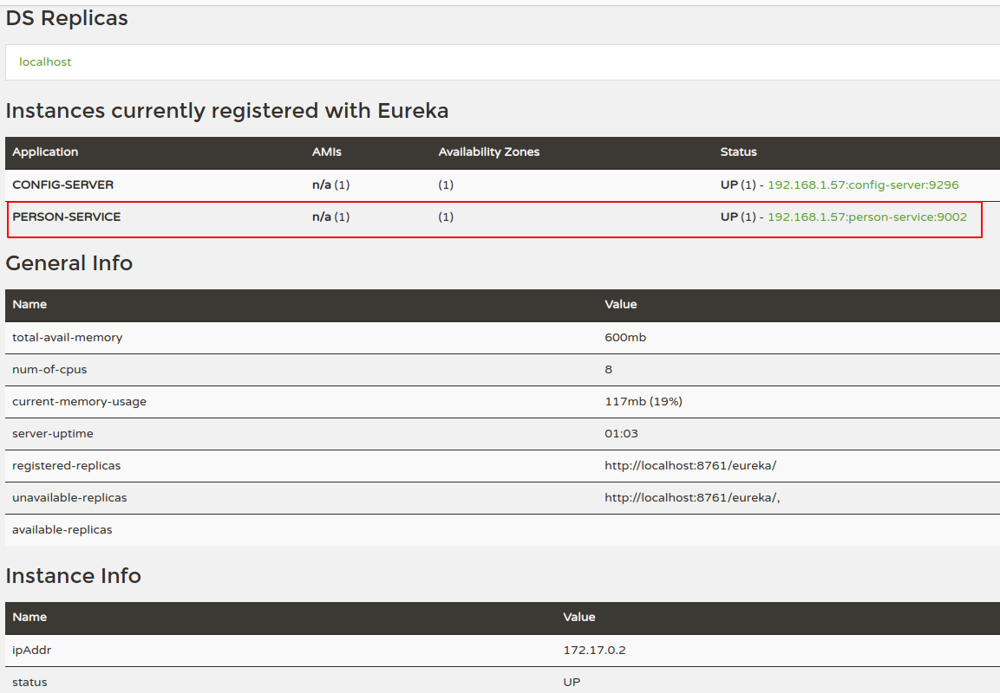

# Java Microservices - Person Service


## Dependencies
* Linux, VirtualBox or Docker Desktop
* Java 11
* Maven
* Git Config Server Repository  
* Spring Boot : 2.5.0
* Netflix Eureka Client
* Google Container Tools
* H2 Database
* Lombok
* Zipkin


## Kafka Configuration

### Running Kafka

```shell
docker-compose -f src/main/docker/kafka.yml up -d
```

#### Then run kafka exec by docker image

```shell
docker exec -it docker_kafka_1 bash
```

### Kafka Topic Create

```shell
kafka-topics --create --zookeeper localhost:2181 --replication-factor 1 --partitions 1 --topic salary-to-person-2
```
```shell
kafka-topics --create --zookeeper localhost:2181 --replication-factor 1 --partitions 1 --topic person-to-salary-2
```

### Kafka Topic Describe

```shell
kafka-topics --describe --topic jkfk-1-topic --bootstrap-server localhost:9092
```

### Kafka Console Consumer

```shell
kafka-console-consumer --topic person-to-salary-2 --from-beginning --bootstrap-server localhost:9092
```

### Listing Topics

```shell
kafka-topics --list --zookeeper zookeeper:2181
or
kafka-topics --bootstrap-server=localhost:9092 --list
```

```text
run java app-> $ ./mvnw
```

## Pub-Sub Kafka
I used postman


## Configuration 
src/main/docker/app.yml
```yaml
version: '3.8'
services:
  person-service:
    image: cevheri/person-service
    environment:
      - _JAVA_OPTIONS=-Xmx512m -Xms256m
      - APP_SLEEP=10 # for zipkin
    ports:
      - 9002:9002
  zipkin:
    image: openzipkin/zipkin
    ports:
      - 9411:9411
```

We will use github public repository for our configuration:
https://github.com/cevheri/microservices-config-server

---
## Development
```shell
$ ./mvnw package
$ java -jar target/*.jar
```
Visit : http://localhost:8761/eureka/apps/person-service

---
## Production With Docker
We will create Docker Image using Google Container Tools and run this Docker Image with Docker Compose.

### Build docker image:
```shell
$ ./mvnw -Pprod clean verify jib:dockerBuild

...
[INFO] Executing tasks:
[INFO] [==============================] 100.0% complete
[INFO] 
[INFO] ------------------------------------------------------------------------
[INFO] BUILD SUCCESS
[INFO] ------------------------------------------------------------------------
[INFO] Total time:  17.728 s
[INFO] Finished at: 21:45:11+03:00
[INFO] ------------------------------------------------------------------------
```

---

### Run:
```shell
$ docker-compose -f src/main/docker/app.yml up -d

Creating person-service ... done
```
---
Visit : http://localhost:8761/eureka/apps/person-service
```xml
<application>
    <name>PERSON-SERVICE</name>
    <instance>
        <instanceId>192.168.1.57:person-service:9002</instanceId>
        <hostName>service-registry</hostName>
        <app>PERSON-SERVICE</app>
        <ipAddr>192.168.1.57</ipAddr>
        <status>UP</status>
        ...
        ...
    </instance>
</application>
```

---
### View docker images:
```shell
$ docker images

REPOSITORY                   TAG            IMAGE ID       CREATED             SIZE
cevheri/person-service       latest         57a100df8bcd   26 minutes ago      287MB

```

### View docker containers:
````shell
$ docker ps

CONTAINER ID   IMAGE                      COMMAND                  CREATED             STATUS          PORTS                                       NAMES
2ca74578a26c   cevheri/person-service      "bash -c /entrypoint…"   8 seconds ago       Up 6 seconds    0.0.0.0:9002->9002/tcp, :::9002->9002/tcp   person-service

````

### Stop Docker Compose:
```shell
$ docker-compose -f src/main/docker/app.yml down

```

---
### Screenshots

