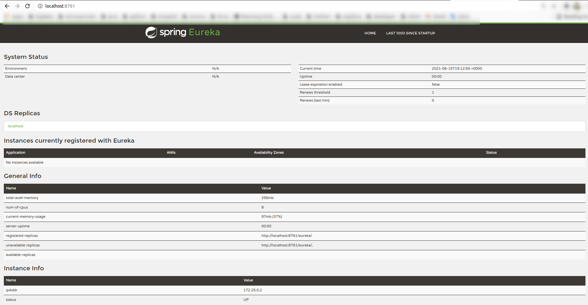

# Java Microservice - Service Registry


## Dependencies
* Linux, VirtualBox or Docker Desktop
* Java 11
* Maven
* Spring Boot : 2.5.0  
* Spring Boot Starter : https://start.spring.io/
* Spring Cloud : https://spring.io/projects/spring-cloud
* Netflix Eureka Server : https://spring.io/guides/gs/service-registration-and-discovery/
* Google Container Tools : https://github.com/GoogleContainerTools/jib

## Configuration 
src/main/docker/app.yml
```yaml
version: '3.8'
services:
  service-registry:
    image: cevheri/service-registry
    environment:
      - _JAVA_OPTIONS=-Xmx512m -Xms256m
    ports:
      - 8761:8761
```

---
## Development
```shell
$ ./mvnw package
$ java -jar target/*.jar
```
Visit : http://localhost:8761/

---
## Production With Docker
We will create Docker Image using Google Container Tools and run this Docker Image with Docker Compose.

### Build docker image:
```shell
$ ./mvnw -Pprod clean verify jib:dockerBuild

...
[INFO] Executing tasks:
[INFO] [==============================] 100.0% complete
[INFO] 
[INFO] ------------------------------------------------------------------------
[INFO] BUILD SUCCESS
[INFO] ------------------------------------------------------------------------
[INFO] Total time:  17.728 s
[INFO] Finished at: 21:45:11+03:00
[INFO] ------------------------------------------------------------------------
```

---

### Run:
```shell
$ docker-compose -f src/main/docker/app.yml up -d

Creating docker_service-registry_1 ... done
```
Visit : http://service-registry:8761/

---
### View docker images:
```shell
$ docker images

REPOSITORY                   TAG            IMAGE ID       CREATED          SIZE
cevheri/service-registry     latest         3d6fd7dccfb5   14 minutes ago   291MB

```

### View docker containers:
````shell
$ docker ps

CONTAINER ID   IMAGE                      COMMAND                  CREATED          STATUS          PORTS                                       NAMES
fac279d0d208   cevheri/service-registry   "bash -c /entrypoint…"   18 seconds ago   Up 16 seconds   0.0.0.0:8761->8761/tcp, :::8761->8761/tcp   docker_service-registry_1
````

### Stop Docker Compose:
```shell
$ docker-compose -f src/main/docker/app.yml down

```
---
### Screenshots

